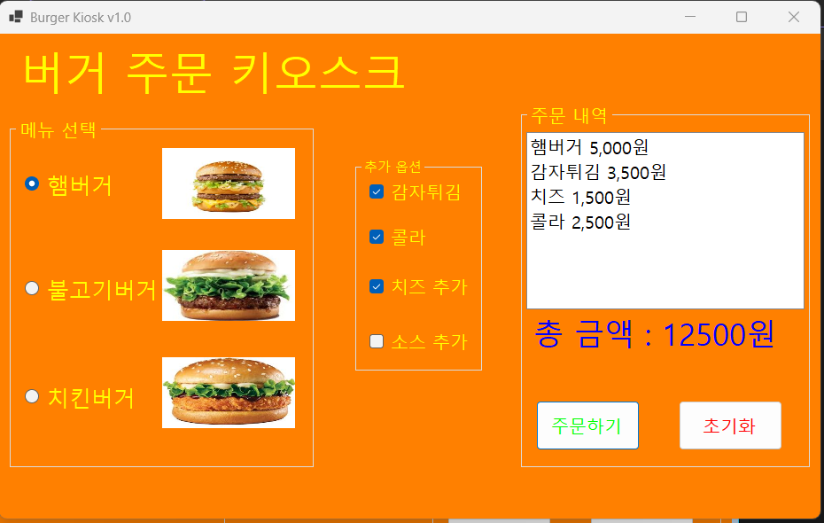
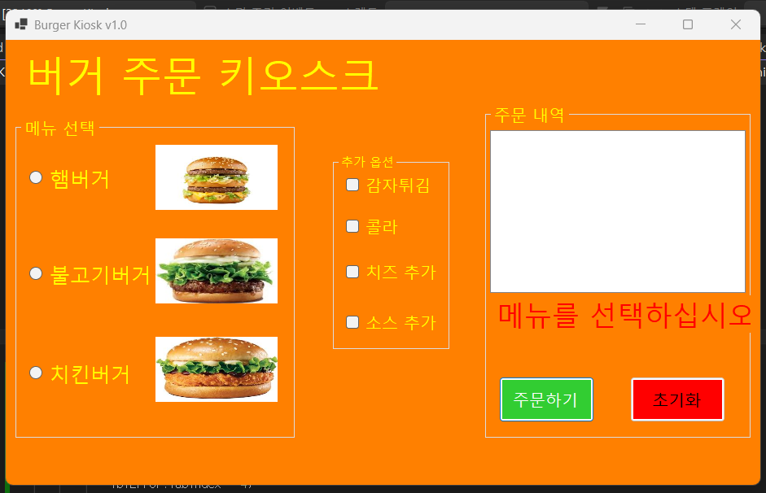
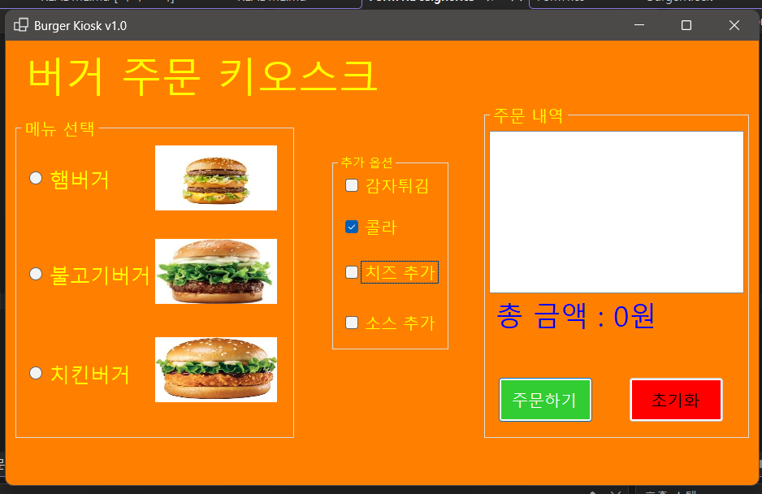

# (C# 코딩) 버거 키오스크

## 개요 
- C# 프로그래밍 학습
- 한줄 소개 : 버거 키오스크 시스템을 C#으로 구현하여 주문 처리 및 메뉴 관리를 학습
- 사용한 플랫폼 :
  - C#, NET Windows Forms, Visual Studio, GitHub
- 사용한 컨트롤 : 
  - Button, Label, TextBox, ListBox, RadioButton, CheckBox, GroupBox
- 사용한 기술과 구현한 기능 :
  - Visual Studio를 이용하여 UI구현
  - 그룹박스로 메뉴 카테고리 구분
  - 라디오 버튼과 체크박스로 옵션 선택 기능 구현
  - 주문 내역을 리스트박스에 표시하여 주문 관리
  - 버튼 클릭 이벤트로 주문 처리 및 초기화 기능 구현

## 실행화면	
- 1단계 코드의 실행 스크린샷

- 구현한 내용 (위 그림 참조)
  - UI구성 : 메뉴 카테고리 그룹박스, 옵션 선택 라디오 버튼과 체크박스, 주문 내역 리스트박스, 주문 처리 버튼
  - 주문 처리 기능 : 주문 버튼 클릭 시 선택된 메뉴와 옵션을 주문 내역과 총 금액에 추가
  - 초기화 기능 : 초기화 버튼 클릭 시 주문 내역과 선택된 옵션, 총 금액 초기화

- 2단계 코드의 실행 스크린샷

- 구현한 내용 (위 그림 참조)
  - 에러 메시지 표시 : 주문 처리 시 메뉴가 선택되지 않은 경우 에러 메시지 표시

- 3단계 코드의 실행 스크린샷

	- 구현한 내용 (위 그림 참조)
	  - Tap키를 이용하여 메뉴 간 이동 기능 추가
	  - 방향키 이용하여 아이템 간 이동가능
	  - Space키를 이용하여 아이템 선택 기능 추가
	  - Enter키를 이용하여 주문 처리 기능 추가